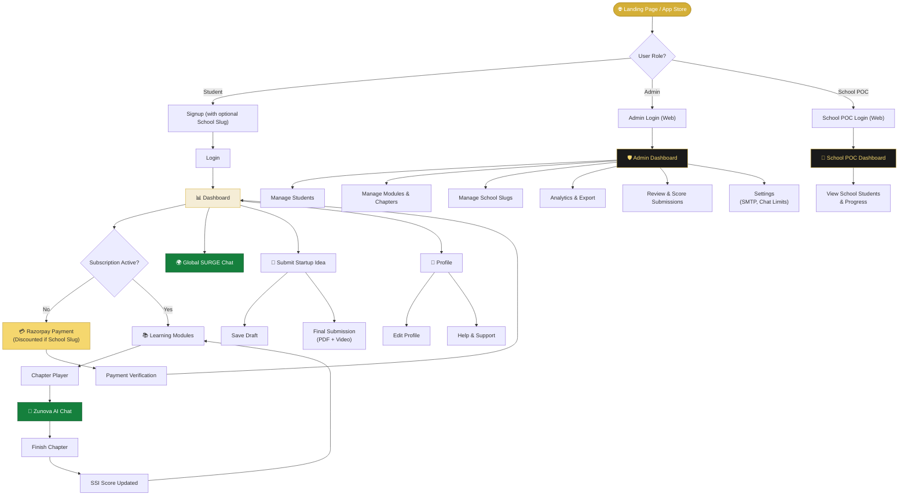
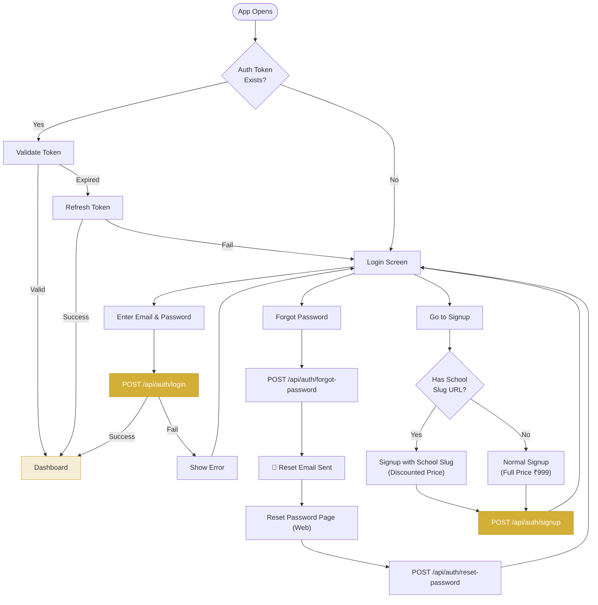
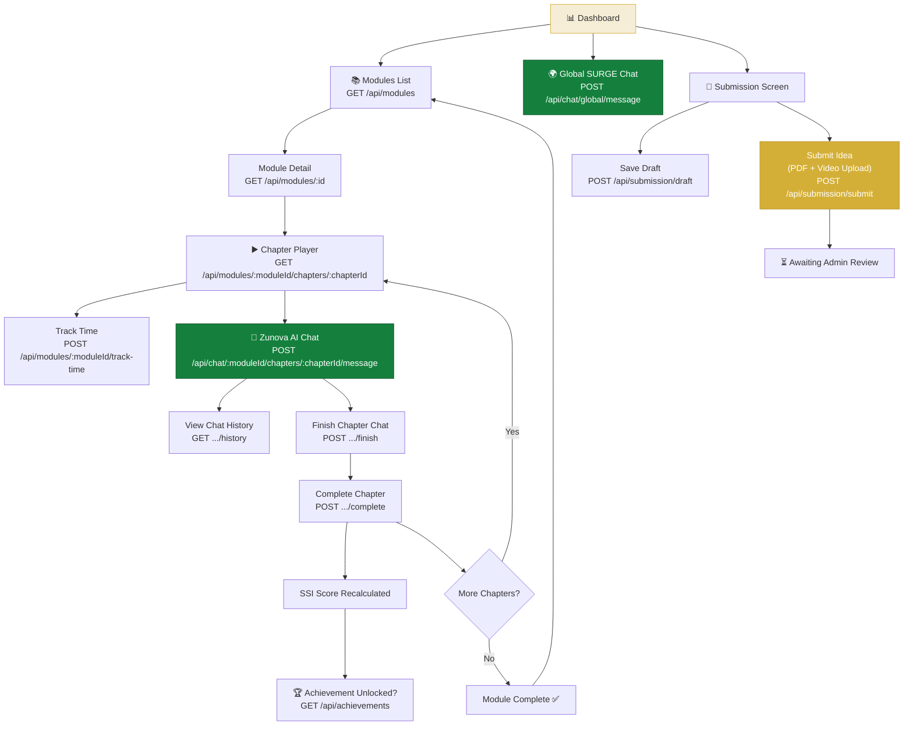
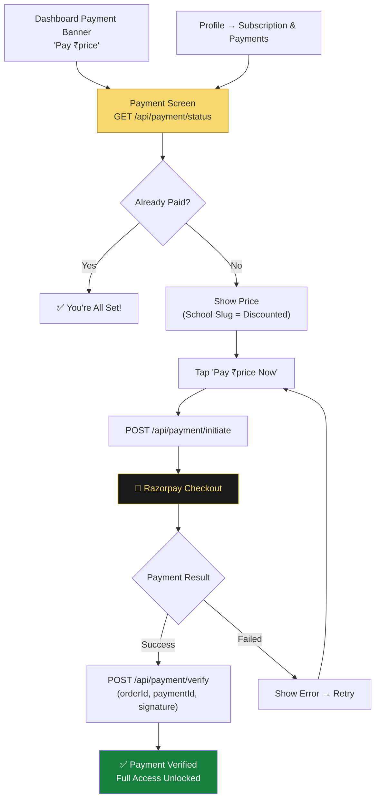
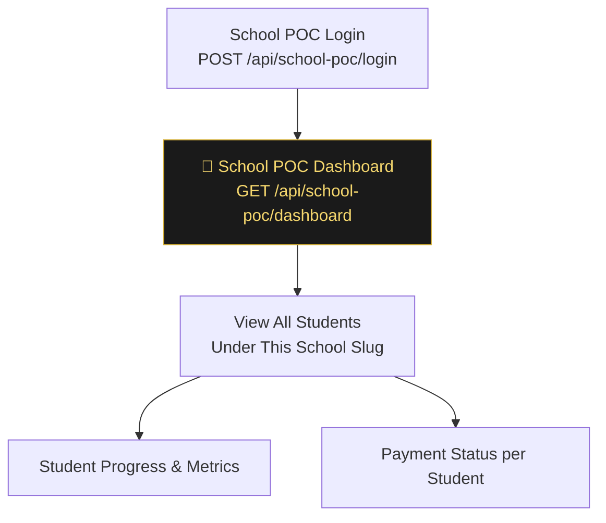
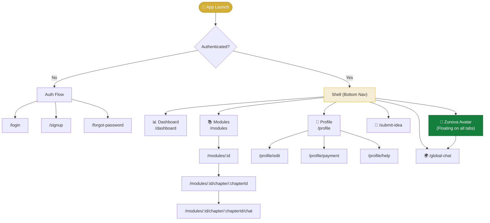

# Future Titans — User Journey Flowchart

## Platform Overview

Future Titans is a multi-platform innovation ecosystem with **3 user roles** across **3 surfaces**:

| Role | Surface | Entry Point |
|------|---------|-------------|
| **Student** | Flutter Mobile App | Signup → Pay → Learn |
| **Admin** | Next.js Web Panel | `/admin` |
| **School POC** | Next.js Web Panel | `/school-poc/login` |

---

## 1. Complete User Journey — High Level

---

## 2. Student Authentication Flow

---

## 3. Student Learning Flow (Mobile App)

---

## 4. Payment Flow

---

## 5. Admin Flow (Web Portal)

```mermaid
flowchart TD
    A_LOGIN["Admin Login (Web)<br/>POST /api/auth/login"]
    A_LOGIN --> A_DASH["🛡️ Admin Dashboard<br/>GET /api/admin/dashboard"]

    A_DASH --> STUDENTS["👥 Student Management"]
    STUDENTS --> LIST_S["List / Search / Filter Students<br/>GET /api/admin/students"]
    STUDENTS --> DETAIL_S["Student Detail<br/>GET /api/admin/students/:id"]
    STUDENTS --> TAG_S["Tag Student<br/>POST /api/admin/students/:id/tag"]
    STUDENTS --> DELETE_S["Delete Student<br/>DELETE /api/admin/students/:id"]
    STUDENTS --> EXPORT["Export CSV<br/>GET /api/admin/export/students"]

    A_DASH --> MODULES["📚 Module Management"]
    MODULES --> CREATE_M["Create Module<br/>POST /api/modules"]
    MODULES --> EDIT_M["Edit Module<br/>PUT /api/modules/:id"]
    MODULES --> PUBLISH_M["Publish Module<br/>POST /api/modules/:id/publish"]
    MODULES --> CHAPTERS["Chapter Management<br/>Create / Edit / Delete / Reorder"]

    A_DASH --> SLUGS["🏫 School Slug Management"]
    SLUGS --> CREATE_SLUG["Create Slug (with discounted price)"]
    SLUGS --> EDIT_SLUG["Edit Slug"]
    SLUGS --> VIEW_SLUG_STUDENTS["View Students by Slug"]

    A_DASH --> SUBS["📝 Submission Review"]
    SUBS --> ALL_SUBS["List All Submissions<br/>GET /api/submission/admin/all"]
    SUBS --> SCORE["Score Submission<br/>PUT /api/submission/admin/:id/score"]
    SUBS --> DOWNLOAD["Download PDF / Video"]

    A_DASH --> ANALYTICS["📊 Analytics<br/>GET /api/admin/analytics"]
    A_DASH --> SETTINGS["⚙️ Settings"]
    SETTINGS --> SMTP["SMTP Configuration"]
    SETTINGS --> CHAT_LIMITS["Chat Message Limits & Reset"]

    style A_DASH fill:#1A1A1A,stroke:#D4AF37,color:#F5D76E
    style SLUGS fill:#F5D76E,stroke:#B8952E
```

---

## 6. School POC Flow (Web Portal)

---

## 7. Mobile App Navigation Structure

---

## API Endpoint Summary

| Category | Endpoint | Method | Auth |
|----------|----------|--------|------|
| **Auth** | `/api/auth/signup` | POST | — |
| | `/api/auth/login` | POST | — |
| | `/api/auth/refresh` | POST | — |
| | `/api/auth/profile` | GET/PUT | Token |
| | `/api/auth/forgot-password` | POST | — |
| | `/api/auth/reset-password` | POST | — |
| **Modules** | `/api/modules` | GET | Token |
| | `/api/modules/:id` | GET | Token |
| | `/api/modules/:moduleId/chapters/:chapterId` | GET | Token |
| | `/api/modules/:moduleId/track-time` | POST | Token |
| **AI Chat** | `/api/chat/:moduleId/chapters/:chapterId/message` | POST | Student |
| | `/api/chat/:moduleId/chapters/:chapterId/finish` | POST | Student |
| | `/api/chat/:moduleId/chapters/:chapterId/complete` | POST | Student |
| | `/api/chat/global/message` | POST | Student |
| | `/api/chat/ssi` | GET | Student |
| **Payment** | `/api/payment/status` | GET | Token |
| | `/api/payment/initiate` | POST | Token |
| | `/api/payment/verify` | POST | — |
| **Submission** | `/api/submission/draft` | POST | Student |
| | `/api/submission/submit` | POST | Student |
| **Achievements** | `/api/achievements` | GET | Token |
| **Admin** | `/api/admin/dashboard` | GET | Admin |
| | `/api/admin/students` | GET | Admin |
| | `/api/admin/slugs` | CRUD | Admin |
| | `/api/admin/analytics` | GET | Admin |
| **School POC** | `/api/school-poc/login` | POST | — |
| | `/api/school-poc/dashboard` | GET | POC Token |
